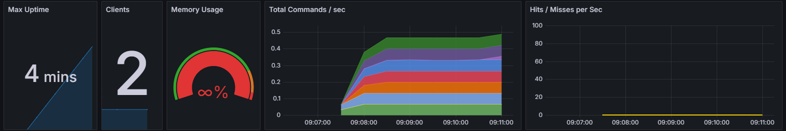

run variables.ps1 to get login detials for azure 
To get data showing in in grafana

Set up the compose to have redis, redis exporter grafana and protmeotus 

To check grafana the promteheus is working 

set up grafana 
admin:admin

add prometheus as a data source, giving http://prometheus:9090 as server url

import the redis dahsbarod with id 763

docker exec -it redis redis-cli into your container of redus

add a kv pair
127.0.0.1:6379> SET mykey "Hello, Redis!"
OK

ping it 
127.0.0.1:6379> GET mykey
"Hello, Redis!"

Happy day will show data , sort it by the last 5 mins to see anything of value 

